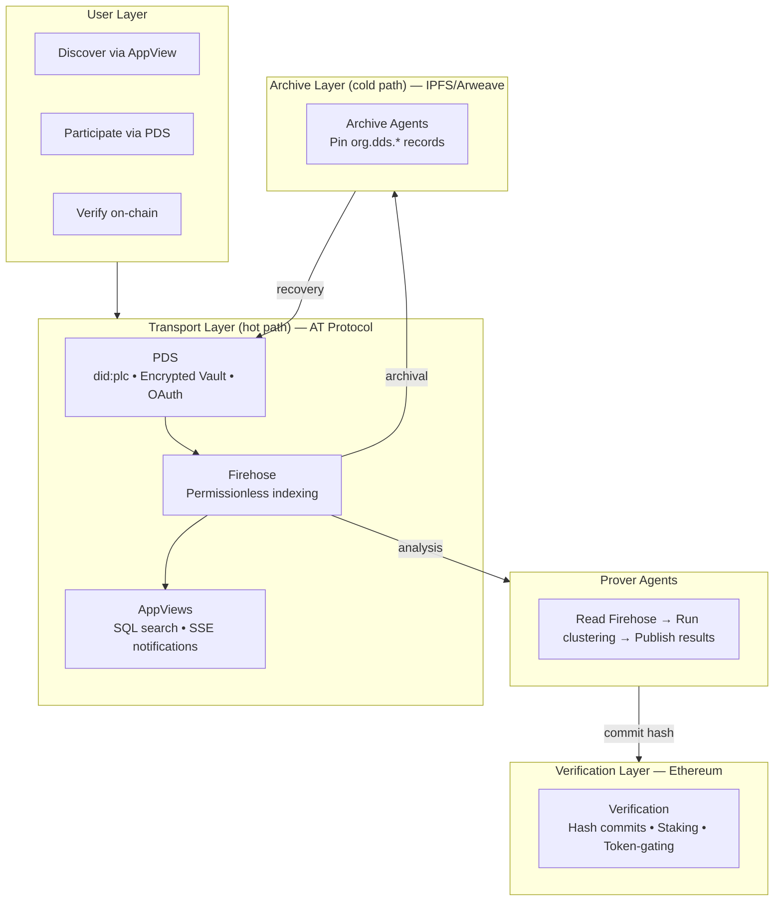
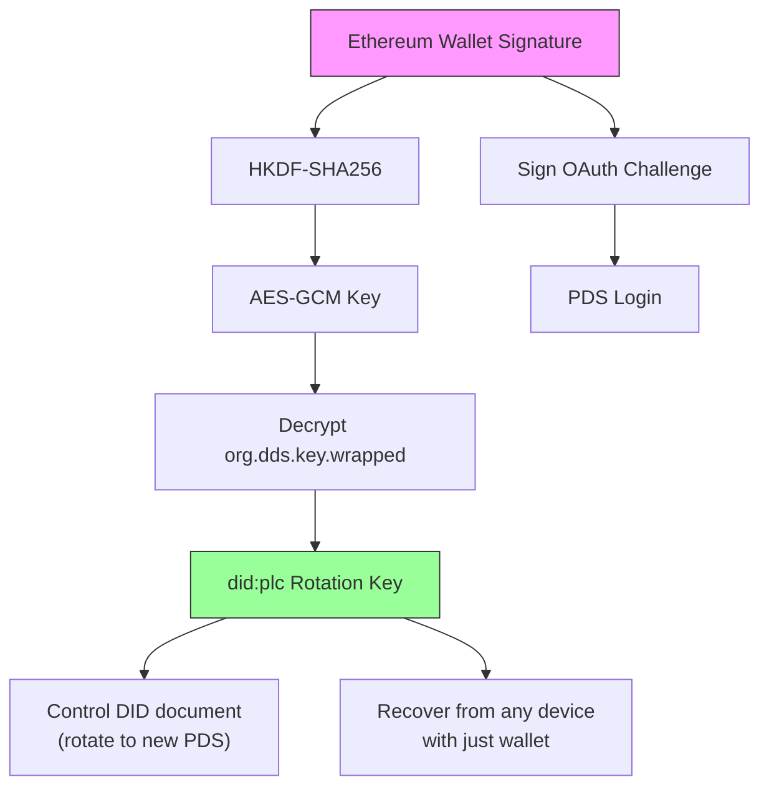
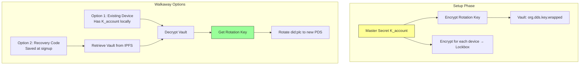
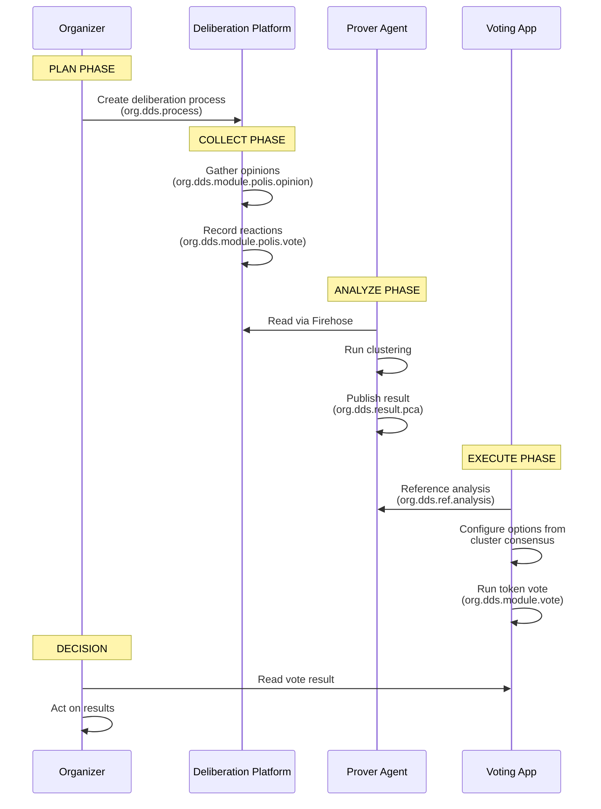

# RFC 0013: Decentralized Deliberation Standard (DDS)

| Metadata       | Value                                          |
| :------------- | :--------------------------------------------- |
| **RFC ID**     | 0013                                           |
| **Title**      | DDS: Verifiable Deliberation on AT Protocol    |
| **Status**     | Draft                                          |
| **Created**    | 2026-01-13                                     |
| **Supersedes** | RFC-0012, RFC-0005                             |
| **Related**    | [Privacy Addendum](./0013-privacy-addendum.md) |

## Abstract

This RFC defines the **Decentralized Deliberation Standard (DDS)**, a vendor-neutral protocol for secure, censorship-resistant public deliberation.

DDS is organized around **four design tensions**:

| Tension | Resolution |
|---------|------------|
| Ownership vs Convenience | Encrypted Key Vault enables walkaway without wallets |
| Discoverability vs Durability | AT Protocol hot path + IPFS/Arweave cold path |
| Provable vs Economical Computation | Prover Agents publish verifiable results economically |
| Autonomy vs Interoperability | Layered lexicons + Plan/Collect/Analyze lifecycle |

The protocol leverages **AT Protocol** for transport, **IPFS/Arweave** for archival, and **Ethereum** for verification.

> **Draft Notice**: The cryptographic mechanisms (Encrypted Key Vault, Sign-to-Derive, Device Graph, Recovery Key) and Ethereum-based proposals (on-chain verification, staking, token-gating, ZK proofs) described in this RFC are **preliminary designs requiring further investigation**. They represent the directional intent, not finalized specifications. Specific primitives, key derivation schemes, and on-chain architectures are subject to change after security review and prototyping.

## 1. Design Philosophy

### 1.1 The Walkaway Test

> **Definition**: If all providers vanish, users retain sovereign control of their cryptographic identity and can recover their data from decentralized archives.

We're leaning towards this as a core design goal for DDS. It requires:
- Users control their `did:plc` Rotation Keys (not just Signing Keys)
- Data is archived to censorship-resistant storage (IPFS/Arweave)
- Recovery is possible from any device with the right credentials

### 1.2 The Four Design Tensions

| Tension | Resolution |
|---------|------------|
| **Ownership vs Convenience** | Users own their cryptographic identity without needing hardware wallets or self-hosted infrastructure. The Encrypted Key Vault provides walkaway capability with web2-friendly login. |
| **Discoverability vs Durability** | AT Protocol enables instant search and real-time discovery (discoverability). IPFS/Arweave ensures data survives provider death (durability). |
| **Provable vs Economical Computation** | Verifiable analysis is expensive to run yourself. DDS uses Prover Agents to provide provable results economically—you get cryptographic guarantees without the compute costs. |
| **Autonomy vs Interoperability** | Apps define their own data formats via product lexicons (autonomy). Shared base lexicons and the public Firehose enable permissionless cross-app data integration (interoperability). |

When in doubt, we optimize for **usability without sacrificing the Walkaway Test**.

## 2. Architecture Overview



## 3. Ownership vs Convenience

> Users own their cryptographic identity without needing hardware wallets or self-hosted infrastructure. The Encrypted Key Vault provides walkaway capability with web2-friendly login.

### 3.1 PDS Hosting Tiers

| Tier | Name | Description |
|------|------|-------------|
| **2** | Self-Hosted | User brings their own PDS (e.g., standard Bluesky or self-hosted). Direct authentication. |
| **1** | Managed | User authenticates via Email/Phone/Wallet/ZKPass. Application auto-provisions a PDS account. |
| **0** | Anonymous | Guest user with no verified identifier. Lightweight PDS authenticated by local `did:key`. |

A single Managed PDS instance is multi-tenant, capable of hosting thousands of accounts (similar to Bluesky PDS architecture).

### 3.2 The Encrypted Key Vault

While the PDS manages _posting_ (Signing Keys), the user must retain control over _identity_ (Rotation Keys). In a Managed model, if the PDS disappears or turns malicious, the user could be locked out without their Recovery Key.

> **Draft**: The vault design below (Type A and Type B) is a first proposal. The specific cryptographic primitives (HKDF-SHA256, AES-GCM, did:key exchange keys), key derivation flows, and Lockbox protocol need formal security review before implementation.

#### Core Concepts

| Term | Purpose | Mechanism | Trust Requirement |
|------|---------|-----------|-------------------|
| **Encrypted Vault** (`org.dds.key.wrapped`) | Sovereign backup of Rotation Key | Rotation Key encrypted by Master Secret ($K_{account}$), stored in Repository | None (encrypted at rest) |
| **Lockbox** | Add new device to account | $K_{account}$ encrypted for target device's public key | Requires PDS cooperation |
| **Migration (Walkaway)** | Escape malicious/failed PDS | Use decrypted Rotation Key to update `did:plc` document | Sovereign (no PDS needed) |

#### Type A: Wallet-Derived Vault

For users logging in with an Ethereum Wallet, we use the **"Sign-to-Derive"** pattern (pioneered by Fileverse.io):

1. **Generate**: Client generates a random Recovery Key (`did:plc` rotation key).
2. **Derive**: User signs a deterministic, domain-bound message. The signature seeds **HKDF-SHA256** to derive a symmetric **AES-GCM Key**.
3. **Store**: Recovery Key is encrypted with this AES Key. Ciphertext stored in Repository (`org.dds.key.wrapped`).
4. **Recover**: User can recover identity from any device by re-signing the challenge.

**Reference**: Mirrors `@fileverse/crypto` architecture ([`src/ecies/core.ts`](https://github.com/fileverse/fileverse-cryptography/blob/main/src/ecies/core.ts)), using `@noble/ciphers` and `@noble/hashes`.



#### Type B: Device Graph Vault

For users without a global key (Email/Phone/Guest):

1. **Master Secret**: Random symmetric key ($K_{account}$) encrypts the user's Rotation Key.
2. **Device Graph**: Each device has a local `did:key` (Exchange Key for encryption).
3. **Lockbox Distribution**: $K_{account}$ is encrypted for each device's Exchange Key, stored in Repository.

**Device Sync Flow**:
1. **Device B (new)**: Generates local `did:key`, displays Public Key via QR Code.
2. **Device A (existing)**: Scans QR, validates fingerprint (MITM protection), encrypts $K_{account}$ for Device B.
3. **Transport**: Device A uploads Lockbox to PDS. Device B downloads, decrypts, accesses Vault.

> **Security**: QR Code verification is MANDATORY. If PDS is known-malicious, don't sync—decrypt Rotation Key and migrate immediately.



> **Critical**: Users MUST save a Recovery Code (raw $K_{account}$) at signup. Without this or a device, the Rotation Key is irrecoverable — the user loses walkaway capability (cannot migrate to a new PDS) but retains normal PDS access via Email/Phone.

### 3.3 Authentication

All tiers use standard **AT Protocol OAuth**.

- **Signing**: The PDS manages the Signing Key and signs posts/votes on behalf of the user.
- **Benefit**: Simplified client architecture, compatibility with standard AT Proto clients.
- **Trade-off**: OAuth may be "heavy" for ephemeral Guests, but we retain it for a unified auth path.

### 3.4 The 72h Safety Net

We rely on the **did:plc 72-hour Grace Period**. If a malicious PDS or compromised device rotates keys, the user has 72 hours to undo using their Wallet or Backup Code.

## 4. Discoverability vs Durability

> Data remains instantly discoverable and searchable while surviving provider death. AT Protocol handles the hot path (discovery); IPFS/Arweave handles the cold path (durability).

### 4.1 The Hybrid Architecture

We respect Waku and IPFS—their work on censorship-resistant infrastructure is foundational. However, for **public deliberation at scale**, pure P2P protocols face specific challenges:

| Challenge | Pure P2P | AT Protocol |
|-----------|----------|-------------|
| **Discovery** | Requires knowing CID beforehand | Firehose enables permissionless indexing |
| **Search** | DHT lookups add latency | SQL-backed AppViews, millisecond response |
| **Semantic Interop** | No standard schema system | Lexicons provide human-readable schemas |
| **Moderation** | No ecosystem equivalent | Labeler architecture |

**Our Hybrid**: AT Protocol for the hot path (discovery, search, real-time), IPFS/Arweave for the cold path (archival, walkaway), Ethereum for the verification layer (hash commits, sovereignty).

### 4.2 Network Archival

- **Role**: Archive Agents listen to the Firehose for `org.dds.*` commits.
- **Action**: Pin Repository updates to IPFS/Arweave.
- **Keys in Repo**: Since `org.dds.key.wrapped` is in the Repository, it's automatically archived.
- **Result**: Even if Agora vanishes, User's Identity (PLC Directory) and Vault (IPFS) are recoverable.

### 4.3 Local Resilience

- **Cache**: Client mirrors the Encrypted Vault Blob to `IndexedDB`.
- **Export**: Users can perform "On-Demand Export" (decrypt in memory) to download CAR file + unlocked keys.

## 5. Provable vs Economical Computation

> Verifiable analysis is expensive to run yourself. Prover Agents provide provable results economically—cryptographic guarantees without the compute costs.

> **Draft**: The Prover Protocol and trust levels below are conceptual. The on-chain verification layer (hash commits, ZK proof verification, staking) requires significant research into feasibility, gas costs, and proof system selection.

### 5.1 The Cost Problem

Running clustering analysis (PCA, Reddwarf) requires:
- **Data access**: Reading all votes/opinions from the Firehose for a given conversation
- **Compute**: Running matrix decomposition and clustering algorithms
- **Infrastructure**: Maintaining servers to process conversations continuously

For a single user to verify results independently, they'd need to replicate this entire pipeline. This is impractical at scale — most users lack both the infrastructure and the expertise.

### 5.2 The Prover Protocol

DDS solves this by separating **computation** from **verification**:

**Agent Protocol**:
1. **Input**: Agent defines a "Scope" (Conversation ID + Time Window).
2. **Process**: Agent reads all Repositories from the Firehose matching the Scope.
3. **Compute**: Runs PCA/Clustering (e.g., Reddwarf).
4. **Output**: Publishes `org.dds.result.pca`.

Because inputs (votes on the Firehose) and algorithm (open-source) are public, **anyone can re-run the computation to verify a Prover's results**. This makes the system auditable without requiring every user to run their own prover.

### 5.3 Trust Levels

| Level | Mechanism | Cost | Guarantee |
|-------|-----------|------|-----------|
| **Reputation** | Prover publishes results to Firehose | Free for users | Trust the Prover's reputation |
| **Spot check** | Any party re-runs computation independently | Moderate (compute costs) | Deterministic verification |
| **Trustless** | Prover submits proof on-chain; clients verify cheaply (e.g., ZK proof verification) | Gas fees | Cryptographic proof — no trust required (see Appendix A.1) |

## 6. Autonomy vs Interoperability

> Apps define their own data formats via product lexicons, while sharing data standards via base lexicons and the public Firehose. The Plan → Collect → Analyze lifecycle shows how autonomous apps exchange data across boundaries.

### 6.1 The Deliberation Lifecycle

DDS organizes deliberation into three phases, each potentially handled by different applications:

This lifecycle is intentionally general. It serves formal governance (a city running participatory budgeting, a DAO voting on treasury allocation), community self-organization (an open-source project shaping its roadmap, a co-op making collective decisions), and bottom-up movements that channel protest energy into concrete proposals—going from "revolution" to "constitution." The process can be a single open discussion or a multi-step pipeline with eligibility rules, multiple rounds, and binding votes.

| Phase | Purpose | Example Apps |
|-------|---------|--------------|
| **Plan** | Design the deliberation process: define steps (e.g., open discussion, consultation, vote), set eligibility, import context | Community platforms, grassroots organizers, governance tools |
| **Collect** | Gather participant input: opinions, votes, comments | Deliberation platforms, voting apps |
| **Analyze** | Process data and derive insights: clustering, summaries, consensus | Prover Agents, analysis dashboards |

Applications specialize in one or more phases, but **interoperate via shared lexicons**. Any organizing app—a community platform, a DAO, a grassroots coalition—can orchestrate a full cycle: plan with its own UI, collect via a deliberation platform, analyze via a Prover, then act on results.



### 6.2 Layered Lexicons

DDS uses a layered lexicon design enabling permissionless interoperability:

```
┌────────────────────────────────────────────────────────┐
│                   PRODUCT LEXICONS                      │
│  (Domain-specific, owned by each app)                  │
│                                                        │
│  org.dds.module.polis  - Deliberation (opinions, votes)│
│  org.dds.module.vote   - Voting (token, quadratic)     │
│  org.dds.result.pca    - Clustering analysis           │
│  org.dds.result.*      - Other analysis outputs        │
└────────────────────────────────────────────────────────┘
                          │
                          ▼
┌────────────────────────────────────────────────────────┐
│                    BASE LEXICONS                        │
│  (Shared primitives, used by all apps)                 │
│                                                        │
│  org.dds.identity.*   - DID profiles, verification     │
│  org.dds.auth.*       - Permissions, capabilities      │
│  org.dds.org.*        - Organizations, DAOs, groups    │
│  org.dds.ref.*        - Cross-app references           │
└────────────────────────────────────────────────────────┘
                          │
                          ▼
┌────────────────────────────────────────────────────────┐
│                  AT PROTOCOL BASE                       │
│  com.atproto.*, app.bsky.*                             │
└────────────────────────────────────────────────────────┘
```

**Base Lexicons** (shared by all apps):
- `org.dds.identity.*` — DID profiles, verification status
- `org.dds.auth.*` — Capabilities, permissions, delegation
- `org.dds.org.*` — Organizations, DAOs, membership
- `org.dds.ref.*` — Cross-app references (point to records in other namespaces)

**Product Lexicons** (owned by each app):
- `org.dds.module.polis` — Deliberation format (opinions, votes)
- `org.dds.module.vote` — Generic voting (token-weighted, quadratic, etc.)
- `org.dds.result.pca` — Clustering analysis outputs

### 6.3 Modular Inputs

DDS supports any deliberation type via pluggable modules.

**`org.dds.module.polis` (Agora)**:
- **Opinion**: `{ text: string }`
- **Vote**: `{ targetCid: string, value: -1|0|1 }`

Other product lexicons follow the same pattern, each defining their own record types.

### 6.4 Cross-App Interoperability

Any app can **read** another app's product lexicons via the Firehose. The `org.dds.ref.*` lexicon enables explicit references:

```typescript
// A voting app references a deliberation platform's analysis
{
  "$type": "org.dds.module.vote.proposal",
  "title": "Fund Proposal Alpha",
  "context": {
    "$type": "org.dds.ref.analysis",
    "uri": "at://did:plc:abc.../org.dds.result.pca/xyz",
    "cid": "bafyrei..."
  },
  "options": [
    { "label": "Approve", "derivedFrom": "cluster-1-consensus" },
    { "label": "Reject", "derivedFrom": "cluster-2-consensus" }
  ]
}
```

**Common Patterns:**

| Pattern | Description |
|---------|-------------|
| **Sequential Handoff** | Deliberation → Analysis → Voting → Execution |
| **Parallel Collection** | Multiple collection apps feed the same analysis |
| **Context Import** | New process imports conclusions from a previous one |

## 7. Security Considerations

### 7.1 MITM on Device Sync

- **Risk**: During Type B sync, a malicious PDS could present its own key instead of the new device's key.
- **Mitigation**: User MUST verify QR Code containing the new device's DID fingerprint. This bypasses server trust.

### 7.2 Public Exposure of Keys

- **Risk**: Encrypted keys are public on the Firehose.
- **Mitigation**: Mandate high-entropy keys. Weak passwords forbidden. Wallet signatures provide mathematical entropy.

### 7.3 Lost Rotation Key

- **Risk**: Type B users lose all devices and have no Recovery Code. They can still authenticate to the PDS (via Email/Phone) and use the account normally, but the Rotation Key is irrecoverable — they lose walkaway capability and cannot migrate if the PDS fails or turns malicious.
- **Mitigation**: Users MUST save Recovery Code at signup. The UI should clearly communicate that this code protects their ability to leave the PDS, not just account access.

### 7.4 Privacy Trade-off

Managed PDS hosts can technically access user data (signing keys, posts). Users requiring full privacy should self-host their PDS. DDS provides the _capability_ to walk away and self-host, making it a credible choice when needed. See [Privacy Addendum](./0013-privacy-addendum.md) for deeper analysis.

## Appendix: Open Issues

### A.1 Fraud Proving Mechanism

> **Status**: Unresolved
>
> **Draft**: Approaches listed below are speculative. ZK-ML is an active research area with no production-ready solution for PCA-scale computation as of this writing.

"Fraud Proving" via on-chain re-execution is infeasible for heavy clustering algorithms (PCA) on standard EVM chains. Possible approaches:
- **ZK-ML**: Zero-Knowledge Machine Learning proofs
- **Optimistic Dispute**: Committee of human arbiters run code off-chain to resolve disputes

### A.2 Data Availability Attack

> **Status**: Requires client mitigation

**Risk**: A malicious PDS could accept the User's Vault commit and report success, but refuse to publish it to the Firehose. Archive Agents never see the data. If PDS deletes account, user is lost.

**Mitigation**: Clients may need to poll independent Archive Agents to confirm their Vault has been indexed before considering setup "safe."
