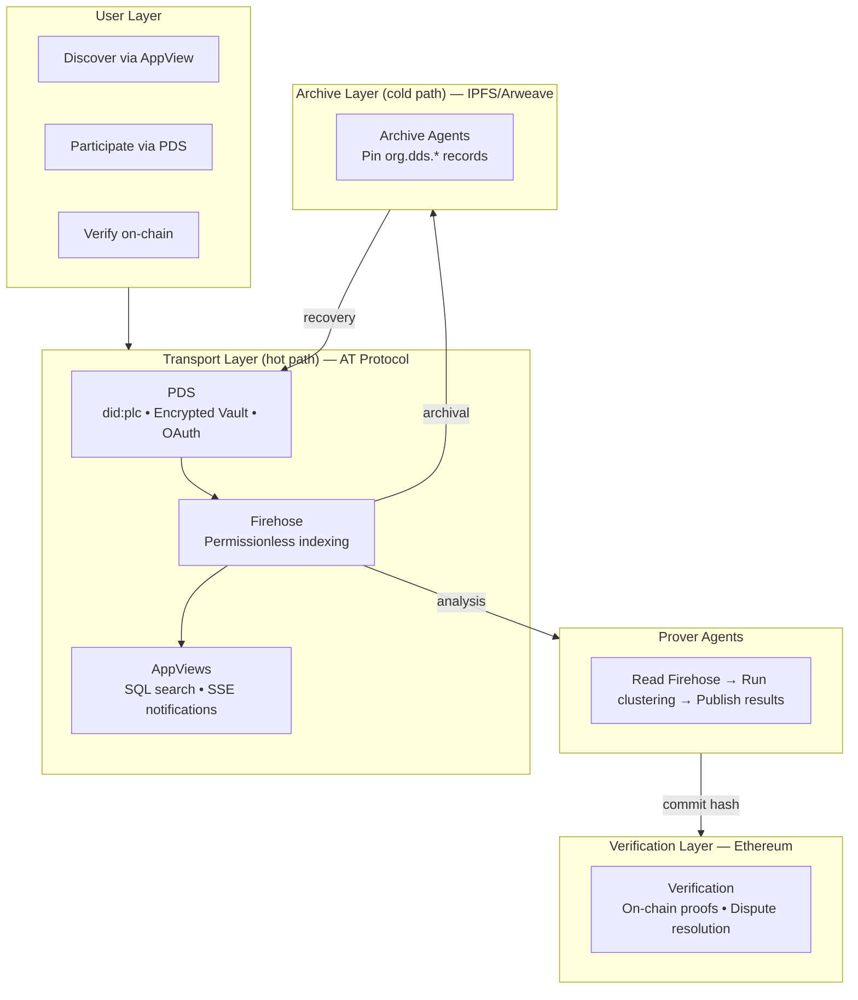

# RFC 0013: Decentralized Deliberation Standard (DDS)

| Metadata       | Value                                          |
| :------------- | :--------------------------------------------- |
| **RFC ID**     | 0013                                           |
| **Title**      | DDS: Verifiable Deliberation on AT Protocol    |
| **Status**     | Draft                                          |
| **Created**    | 2026-01-13                                     |
| **Supersedes** | RFC-0012, RFC-0005                             |
| **Related**    | [Privacy Addendum](./0013-privacy-addendum.md), [Implementation Addendum](./0013-implementation-addendum.md) |

## 1. Design Philosophy

This RFC defines the **Decentralized Deliberation Standard (DDS)**, a vendor-neutral protocol for secure, censorship-resistant public deliberation. The protocol leverages **AT Protocol** for transport, **IPFS/Arweave** for archival, and **Ethereum** for verification.

DDS is organized around **four design tensions**:

| Tension | Why |
|---------|-----|
| **Ownership vs Convenience** | Sovereignty requires users to control their cryptographic keys — but requiring hardware wallets or self-hosted infrastructure creates friction that prevents adoption. We need real ownership with a familiar login experience. |
| **Discoverability vs Durability** | Pure P2P protocols (Logos Messaging (formerly Waku), IPFS, Nostr) provide censorship-resistant storage and messaging, but struggle at scale with: real-time performance, message ordering and conflict resolution, complex queries and search, moderation, and mobile/resource-constrained devices. Federated protocols solve these but introduce provider dependency. We need the UX of federation with the durability guarantees of P2P. |
| **Provable vs Economical Computation** | Running clustering analysis (PCA, Reddwarf) requires significant data access, compute, and infrastructure. Asking every user to replicate this pipeline is impractical — but trusting a single provider's results without verification undermines the system. |
| **Autonomy vs Interoperability** | Self-hosted systems give full autonomy but are siloed — you can define any data model, but you can't leverage other teams' distributed components. Standardized schemas over a shared transport enable separation of concerns: distinct building blocks (Plan, Collect, Analyze) built by different teams that compose permissionlessly. This solves hard problems of data communication at scale that pure self-hosted models cannot. Data privacy (secret content) is niche for a public deliberation standard; participant anonymity is a separate concern. |

When in doubt, we optimize for **usability without sacrificing walkaway capability** — the guarantee that if all providers vanish, users retain sovereign control of their cryptographic identity and can recover their data from decentralized archives.

## 2. Architecture Overview



## 3. Ownership vs Convenience

> **The Walkaway Test**: If all providers vanish, users retain sovereign control of their cryptographic identity and can recover their data from decentralized archives. DDS is designed to pass this test — users control their `did:plc` Rotation Keys (not just Signing Keys), data is archived to censorship-resistant storage, and recovery is possible from any device with the right credentials.
>
> **Why AT Protocol here**: `did:plc` provides portable identity with separate Signing Keys (convenience — PDS manages posting) and Rotation Keys (ownership — user controls migration). Nostr ties identity to a single keypair with no recovery or migration. Logos Messaging has no identity layer. This separation lets us build the Encrypted Key Vault: sovereignty without requiring users to manage keys directly.

### 3.1 PDS Hosting Tiers

| Tier | Name | Description |
|------|------|-------------|
| **2** | Self-Hosted | User brings their own PDS (e.g., standard Bluesky or self-hosted). Direct authentication. |
| **1** | Managed | User authenticates via Email/Phone/Wallet/ZKPass. Application auto-provisions a PDS account. |
| **0** | Anonymous | Guest user with no verified identifier. Lightweight PDS authenticated by local `did:key`. |

A single Managed PDS instance is multi-tenant, capable of hosting thousands of accounts (similar to Bluesky PDS architecture).

### 3.2 The Encrypted Key Vault

While the PDS manages _posting_ (Signing Keys), the user must retain control over _identity_ (Rotation Keys). In a Managed model, if the PDS disappears or turns malicious, the user could be locked out without their Recovery Key.

The **Encrypted Key Vault** solves this: the user's Rotation Key is encrypted and stored in their Repository. Since Repositories are archived to IPFS (Section 4.2), the vault is recoverable even if the PDS vanishes.

| Concept | Purpose |
|---------|---------|
| **Encrypted Vault** | Rotation Key encrypted at rest in the user's Repository — recoverable from any archive |
| **Lockbox** | Mechanism for adding new devices to an account without exposing the Rotation Key |
| **Migration (Walkaway)** | Decrypt the Rotation Key → update `did:plc` document → point to a new PDS |

Two vault designs are proposed:

- **Type A (Wallet-Derived)**: Users with an Ethereum wallet derive an encryption key from a deterministic wallet signature. Recovery requires only the wallet — no backup codes needed.
- **Type B (Device Graph)**: Users without a wallet (Email/Phone/Guest) use a random master secret distributed across devices via encrypted lockboxes. Recovery requires an existing device or a backup code saved at signup.

> **Critical**: Type B users MUST save a Recovery Code at signup. Without this or an existing device, the Rotation Key is irrecoverable — the user loses walkaway capability but retains normal PDS access.

The cryptographic details (key derivation, encryption schemes, device sync protocol) are specified in the [Implementation Addendum](./0013-implementation-addendum.md).

### 3.3 Authentication

All tiers use standard **AT Protocol OAuth**.

- **Signing**: The PDS manages the Signing Key and signs posts/votes on behalf of the user.
- **Benefit**: Simplified client architecture, compatibility with standard AT Proto clients.
- **Trade-off**: OAuth may be "heavy" for ephemeral Guests, but we retain it for a unified auth path.

### 3.4 The 72h Safety Net

We rely on the **did:plc 72-hour Grace Period**. If a malicious PDS or compromised device rotates keys, the user has 72 hours to undo using their Wallet or Backup Code.

## 4. Discoverability vs Durability

### 4.1 The Hybrid Architecture

We considered three protocol families for the transport layer:

- **AT Protocol** (Bluesky): Federated, server-based. PDSes host data, Firehose enables permissionless indexing, Lexicons provide semantic schemas.
- **Logos Messaging** (Status, formerly Waku): P2P gossip messaging. Censorship-resistant relay network, strong privacy properties via P2P gossip, ephemeral by design, no guaranteed ordering.
- **Nostr**: Relay-based pubsub. Simple keypair identity, privacy-friendly via Tor-compatible relay architecture, informal event-kind taxonomy, no formal schema system, no identity migration.

We respect Logos Messaging, Nostr, and IPFS — their work on censorship-resistant infrastructure is foundational. However, for **public deliberation at scale**, pure P2P and relay-based protocols face fundamental challenges:

| Challenge | Nostr / Logos Messaging | AT Protocol |
|-----------|------------------------|-------------|
| **Data availability** | Nostr: relay-dependent, no completeness guarantee. Logos: messages expire, limited retention | Always-on PDS servers, persistent repositories |
| **Performance** | Nostr: fast for simple relay queries. Logos: P2P overhead, impractical on mobile | Standard HTTPS, millisecond response |
| **Message ordering** | Nostr: last-write-wins with known race conditions. Logos: no guaranteed ordering | Server-side total ordering within each repository |
| **Conflict resolution** | Nostr: replaceable events but no merge semantics — concurrent edits silently overwrite. Logos: none | Server-authoritative within each PDS |
| **Search & discovery** | Nostr: search exists via specialized relays, but fragmented — no complete index. Logos: no discovery | Firehose enables permissionless indexing, SQL-backed AppViews |
| **Complex queries** | Nostr: third-party compute services exist but no standardized query API. Logos: basic message filtering only | AppViews provide precomputed query results with standardized APIs |
| **Schema** | Nostr: event kinds are functional but convention-based — no machine-readable validation. Logos: application-defined content types, no shared schema | Lexicons provide formal, machine-enforceable, versionable schemas |
| **Moderation** | Nostr: labeling and reporting exist but are advisory-only — no enforcement infrastructure. Logos: rate-limiting for spam, no content moderation | Labelers with standardized APIs, stackable moderation, speech/reach separation |
| **Mobile** | Nostr: lightweight clients possible. Logos: too resource-heavy | Standard web clients, thin mobile apps |
| **Composable architecture** | Nostr: third-party services exist but each sees a partial network view. Logos: limited ecosystem | Pluggable and composable: base components (AppViews, Labelers, Feed Generators) connect to a complete Firehose, and new components can be built on top of them (e.g., an Analyzer built on the Feed Generator pattern) — any team builds, any user chooses |

These protocols solve real problems — Nostr's ecosystem of relays and third-party services is a genuine innovation, and Logos Messaging's cryptographic spam protection is technically impressive. But for deliberation at scale, the pattern is consistent: AT Protocol provides each capability as protocol-level infrastructure with standardized APIs and a complete data stream, while alternatives solve them through emergent, application-level mechanisms where each service sees a partial view and each client integrates differently. Building a multi-app deliberation ecosystem on these patterns would require reinventing much of what AT Protocol already provides.

Where Nostr and Logos Messaging genuinely excel is **anonymity-first applications**. Nostr's client-relay architecture enables routing through Tor and mixnets. Logos Messaging's P2P gossip means no server ever knows a user's identity. For applications requiring deep anonymity — ZK-anonymous voting, whistleblower platforms, censorship-resistant communication under authoritarian regimes — these protocols are the right foundation. Privacy _can_ be implemented on AT Protocol, but the PDS pattern is an anti-pattern for strong ZK-anonymity: the server inherently knows the user's identity, so anonymity requires workarounds rather than flowing naturally from the architecture. On Nostr and Logos Messaging, anonymity feels native. DDS does not optimize for this. Our earlier work on [Racine](https://github.com/zkorum/racine) (a ZK-first meta-protocol compatible with Waku, Nostr, and AT Protocol) taught us that while ZK anonymous identity is technically superior for privacy, it doesn't match how users actually adopt products — they want familiar identifiers (email, phone, social login), not cryptographic key management. DDS is designed for **public** deliberation, where transparency and verifiability are the point. Participant anonymity where needed is handled at the identity layer (ZK proofs for eligibility without revealing identity), not at the transport layer.

**Our Hybrid**: AT Protocol for the hot path (discovery, search, real-time), IPFS/Arweave for the cold path (archival, walkaway), Ethereum for the verification layer (hash commits, sovereignty).

### 4.2 Network Archival

- **Role**: Archive Agents listen to the Firehose for `org.dds.*` commits.
- **Action**: Pin Repository updates to IPFS/Arweave.
- **Keys in Repo**: Since `org.dds.key.wrapped` is in the Repository, it's automatically archived.
- **Result**: Even if Agora vanishes, User's Identity (PLC Directory) and Vault (IPFS) are recoverable.

### 4.3 Local Resilience

- **Cache**: Client mirrors the Encrypted Vault Blob to `IndexedDB`.
- **Export**: Users can perform "On-Demand Export" (decrypt in memory) to download CAR file + unlocked keys.

## 5. Provable vs Economical Computation

> **Draft**: The Prover Protocol and trust levels below are conceptual. The on-chain verification layer requires significant research into feasibility, gas costs, and proof system selection. This tension is protocol-agnostic — verifiable computation works regardless of the underlying transport layer.

### 5.1 The Cost Problem

Running clustering analysis (PCA, Reddwarf) requires:
- **Data access**: Reading all votes/opinions from the Firehose for a given conversation
- **Compute**: Running matrix decomposition and clustering algorithms
- **Infrastructure**: Maintaining servers to process conversations continuously

For a single user to verify results independently, they'd need to replicate this entire pipeline. This is impractical at scale — most users lack both the infrastructure and the expertise.

### 5.2 The Prover Protocol

DDS solves this by separating **computation** from **verification**:

**Agent Protocol**:
1. **Input**: Agent defines a "Scope" (Conversation ID + Time Window).
2. **Process**: Agent reads all Repositories from the Firehose matching the Scope.
3. **Compute**: Runs PCA/Clustering (e.g., Reddwarf).
4. **Output**: Publishes `org.dds.result.pca`.

Because inputs (votes on the Firehose) and algorithm (open-source) are public, **anyone can re-run the computation to verify a Prover's results**. This makes the system auditable without requiring every user to run their own prover.

### 5.3 Trust Levels

| Level | Mechanism | Cost | Guarantee |
|-------|-----------|------|-----------|
| **Reputation** | Prover publishes results to Firehose | Free for users | Trust the Prover's reputation |
| **Spot check** | Any party re-runs computation independently | Moderate (compute costs) | Deterministic verification |
| **Trustless** | Prover submits proof on-chain; clients verify cheaply (e.g., ZK proof verification) | Gas fees | Cryptographic proof — no trust required (see [Implementation Addendum §3.1](./0013-implementation-addendum.md#31-fraud-proving-mechanism)) |

## 6. Autonomy vs Interoperability

> **Why AT Protocol here**: Nostr's event kinds and Logos Messaging's content types enable interoperability, but through convention rather than enforceable schemas. AT Protocol's Lexicons are machine-readable and PDS-enforced — data that doesn't match the schema is rejected, not silently malformed. Combined with the Firehose, this means any team can read any other team's records with confidence in data shape, enabling true separation of concerns across the Plan → Collect → Analyze → Execute lifecycle.
>
> **On data privacy**: AT Protocol is actively working on private data support via end-to-end encryption (Signal model), but this is still work in progress. For DDS, data privacy (keeping deliberation content secret) is a niche use case — the standard is designed for **public** deliberation, where transparency and verifiability are the point. Participant anonymity is a separate concern not tied to data encryption. See [Privacy Addendum](./0013-privacy-addendum.md) for deeper analysis.

### 6.1 The Deliberation Lifecycle

DDS organizes deliberation into four phases, each potentially handled by different applications:

This lifecycle is intentionally general. It serves formal governance (a city running participatory budgeting, a DAO voting on treasury allocation), community self-organization (an open-source project shaping its roadmap, a co-op making collective decisions), and bottom-up movements that channel protest energy into concrete proposals—going from "revolution" to "constitution." The process can be a single open discussion or a multi-step pipeline with eligibility rules, multiple rounds, and binding votes.

| Phase | Purpose | Example Apps |
|-------|---------|--------------|
| **Plan** | Design the deliberation process: define steps (e.g., open discussion, consultation, vote), set eligibility, import context | Community platforms, grassroots organizers, governance tools |
| **Collect** | Gather participant input: opinions, votes, comments | Deliberation platforms, voting apps |
| **Analyze** | Process data and derive insights: clustering, summaries, consensus | Prover Agents, analysis dashboards |
| **Execute** | Act on analysis: run binding votes, implement decisions | Voting apps, governance tools, DAOs |

Applications specialize in one or more phases, but **interoperate via shared lexicons**. Any organizing app—a community platform, a DAO, a grassroots coalition—can orchestrate a full cycle: plan with its own UI, collect via a deliberation platform, analyze via a Prover, then act on results.


### 6.2 Layered Lexicons

DDS uses a layered lexicon design enabling permissionless interoperability:

```
┌────────────────────────────────────────────────────────┐
│                   PRODUCT LEXICONS                      │
│  (Domain-specific, owned by each app)                  │
│                                                        │
│  org.dds.module.polis  - Deliberation (opinions, votes)│
│  org.dds.module.vote   - Voting (token, quadratic)     │
│  org.dds.result.pca    - Clustering analysis           │
│  org.dds.result.*      - Other analysis outputs        │
└────────────────────────────────────────────────────────┘
                          │
                          ▼
┌────────────────────────────────────────────────────────┐
│                    BASE LEXICONS                        │
│  (Shared primitives, used by all apps)                 │
│                                                        │
│  org.dds.identity.*   - DID profiles, verification     │
│  org.dds.auth.*       - Permissions, capabilities      │
│  org.dds.org.*        - Organizations, DAOs, groups    │
│  org.dds.ref.*        - Cross-app references           │
└────────────────────────────────────────────────────────┘
                          │
                          ▼
┌────────────────────────────────────────────────────────┐
│                  AT PROTOCOL BASE                       │
│  com.atproto.*, app.bsky.*                             │
└────────────────────────────────────────────────────────┘
```

**Base Lexicons** (shared by all apps):
- `org.dds.identity.*` — DID profiles, verification status
- `org.dds.auth.*` — Capabilities, permissions, delegation
- `org.dds.org.*` — Organizations, DAOs, membership
- `org.dds.ref.*` — Cross-app references (point to records in other namespaces)

**Product Lexicons** (owned by each app):
- `org.dds.module.polis` — Deliberation format (opinions, votes)
- `org.dds.module.vote` — Generic voting (token-weighted, quadratic, etc.)
- `org.dds.result.pca` — Clustering analysis outputs

### 6.3 Modular Inputs

DDS supports any deliberation type via pluggable modules.

**`org.dds.module.polis` (Agora)**:
- **Opinion**: `{ text: string }`
- **Vote**: `{ targetCid: string, value: -1|0|1 }`

Other product lexicons follow the same pattern, each defining their own record types.

### 6.4 Cross-App Interoperability

Any app can **read** another app's product lexicons via the Firehose. The `org.dds.ref.*` lexicon enables explicit references:

```typescript
// A voting app references a deliberation platform's analysis
{
  "$type": "org.dds.module.vote.proposal",
  "title": "Fund Proposal Alpha",
  "context": {
    "$type": "org.dds.ref.analysis",
    "uri": "at://did:plc:abc.../org.dds.result.pca/xyz",
    "cid": "bafyrei..."
  },
  "options": [
    { "label": "Approve", "derivedFrom": "cluster-1-consensus" },
    { "label": "Reject", "derivedFrom": "cluster-2-consensus" }
  ]
}
```

**Common Patterns:**

| Pattern | Description |
|---------|-------------|
| **Sequential Handoff** | Deliberation → Analysis → Voting → Execution |
| **Parallel Collection** | Multiple collection apps feed the same analysis |
| **Context Import** | New process imports conclusions from a previous one |

## 7. Implementation Details

The cryptographic mechanisms (Encrypted Key Vault, Sign-to-Derive, Device Graph), Ethereum verification layer, and security considerations are detailed in a separate [implementation addendum](./0013-implementation-addendum.md). These are preliminary designs requiring further investigation — they represent directional intent, not finalized specifications.
