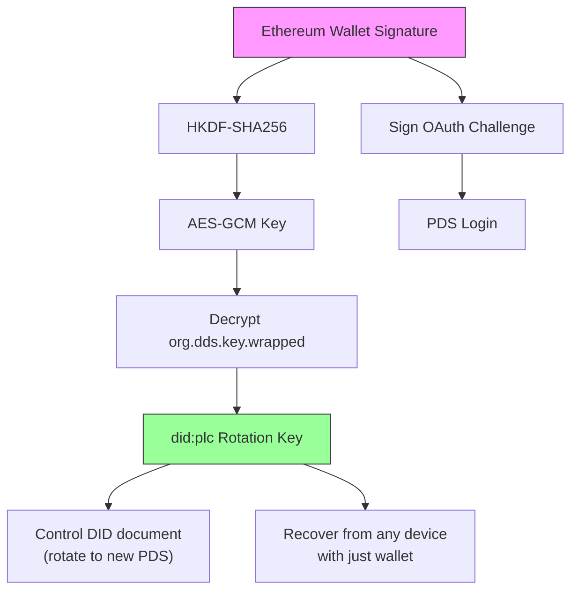
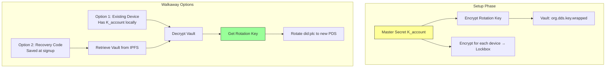

# RFC 0013 — Implementation Addendum

| Metadata       | Value                                                    |
| :------------- | :------------------------------------------------------- |
| **Parent RFC** | [RFC 0013](./0013-agora-atproto-walkaway.md)             |
| **Status**     | Draft                                                    |
| **Created**    | 2026-01-13                                               |

This addendum contains implementation-level details for RFC 0013 (DDS). These are preliminary designs requiring further investigation — they represent directional intent, not finalized specifications.

## 1. Encrypted Key Vault — Cryptographic Design

> **Draft**: The vault designs below (Type A and Type B) are a first proposal. The specific cryptographic primitives (HKDF-SHA256, AES-GCM, did:key exchange keys), key derivation flows, and Lockbox protocol need formal security review before implementation.

### Core Concepts

| Term | Purpose | Mechanism | Trust Requirement |
|------|---------|-----------|-------------------|
| **Encrypted Vault** (`org.dds.key.wrapped`) | Sovereign backup of Rotation Key | Rotation Key encrypted by Master Secret ($K_{account}$), stored in Repository | None (encrypted at rest) |
| **Lockbox** | Add new device to account | $K_{account}$ encrypted for target device's public key | Requires PDS cooperation |
| **Migration (Walkaway)** | Escape malicious/failed PDS | Use decrypted Rotation Key to update `did:plc` document | Sovereign (no PDS needed) |

### 1.1 Type A: Wallet-Derived Vault

For users logging in with an Ethereum Wallet, we use the **"Sign-to-Derive"** pattern (pioneered by Fileverse.io):

1. **Generate**: Client generates a random Recovery Key (`did:plc` rotation key).
2. **Derive**: User signs a deterministic, domain-bound message. The signature seeds **HKDF-SHA256** to derive a symmetric **AES-GCM Key**.
3. **Store**: Recovery Key is encrypted with this AES Key. Ciphertext stored in Repository (`org.dds.key.wrapped`).
4. **Recover**: User can recover identity from any device by re-signing the challenge.

**Reference**: Mirrors `@fileverse/crypto` architecture ([`src/ecies/core.ts`](https://github.com/fileverse/fileverse-cryptography/blob/main/src/ecies/core.ts)), using `@noble/ciphers` and `@noble/hashes`.

### 1.2 Type B: Device Graph Vault

For users without a global key (Email/Phone/Guest):

1. **Master Secret**: Random symmetric key ($K_{account}$) encrypts the user's Rotation Key.
2. **Device Graph**: Each device has a local `did:key` (Exchange Key for encryption).
3. **Lockbox Distribution**: $K_{account}$ is encrypted for each device's Exchange Key, stored in Repository.

**Device Sync Flow**:
1. **Device B (new)**: Generates local `did:key`, displays Public Key via QR Code.
2. **Device A (existing)**: Scans QR, validates fingerprint (MITM protection), encrypts $K_{account}$ for Device B.
3. **Transport**: Device A uploads Lockbox to PDS. Device B downloads, decrypts, accesses Vault.

> **Security**: QR Code verification is MANDATORY. If PDS is known-malicious, don't sync—decrypt Rotation Key and migrate immediately.

> **Critical**: Users MUST save a Recovery Code (raw $K_{account}$) at signup. Without this or a device, the Rotation Key is irrecoverable — the user loses walkaway capability (cannot migrate to a new PDS) but retains normal PDS access via Email/Phone.

## 2. Security Considerations

### 2.1 MITM on Device Sync

- **Risk**: During Type B sync, a malicious PDS could present its own key instead of the new device's key.
- **Mitigation**: User MUST verify QR Code containing the new device's DID fingerprint. This bypasses server trust.

### 2.2 Public Exposure of Keys

- **Risk**: Encrypted keys are public on the Firehose.
- **Mitigation**: Mandate high-entropy keys. Weak passwords forbidden. Wallet signatures provide mathematical entropy.

### 2.3 Lost Rotation Key

- **Risk**: Type B users lose all devices and have no Recovery Code. They can still authenticate to the PDS (via Email/Phone) and use the account normally, but the Rotation Key is irrecoverable — they lose walkaway capability and cannot migrate if the PDS fails or turns malicious.
- **Mitigation**: Users MUST save Recovery Code at signup. The UI should clearly communicate that this code protects their ability to leave the PDS, not just account access.

### 2.4 Privacy Trade-off

Managed PDS hosts can technically access user data (signing keys, posts). Users requiring full data privacy should self-host their PDS. DDS provides the _capability_ to walk away and self-host, making it a credible choice when needed. Note that data privacy (keeping content secret) is distinct from participant anonymity (hiding who said what) — the latter does not require self-hosting. See [Privacy Addendum](./0013-privacy-addendum.md) for deeper analysis.

## 3. Open Issues

### 3.1 Fraud Proving Mechanism

> **Status**: Unresolved
>
> **Draft**: Approaches listed below are speculative. ZK-ML is an active research area with no production-ready solution for PCA-scale computation as of this writing.

"Fraud Proving" via on-chain re-execution is infeasible for heavy clustering algorithms (PCA) on standard EVM chains. Possible approaches:
- **ZK-ML**: Zero-Knowledge Machine Learning proofs
- **Optimistic Dispute**: Committee of human arbiters run code off-chain to resolve disputes

### 3.2 Data Availability Attack

> **Status**: Requires client mitigation

**Risk**: A malicious PDS could accept the User's Vault commit and report success, but refuse to publish it to the Firehose. Archive Agents never see the data. If PDS deletes account, user is lost.

**Mitigation**: Clients may need to poll independent Archive Agents to confirm their Vault has been indexed before considering setup "safe."
