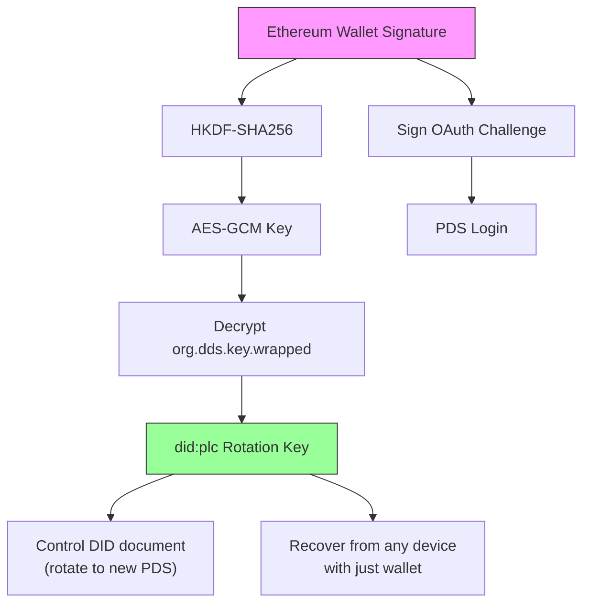
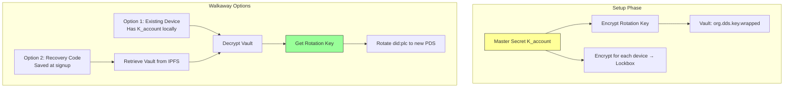

# DDS — Implementation Addendum

| Metadata       | Value                                                    |
| :------------- | :------------------------------------------------------- |
| **Parent**     | [DDS Spec](./0013-agora-atproto-walkaway.md)             |
| **Status**     | Draft                                                    |
| **Created**    | 2026-01-13                                               |

This addendum contains implementation-level details for DDS. These are preliminary designs requiring further investigation — they represent directional intent, not finalized specifications.

## 1. Encrypted Key Vault — Cryptographic Design

> **Draft**: The vault designs below (Type A and Type B) are a first proposal. The specific cryptographic primitives (HKDF-SHA256, AES-GCM, did:key exchange keys), key derivation flows, and Lockbox protocol need formal security review before implementation.

### Core Concepts

| Term | Purpose | Mechanism | Trust Requirement |
|------|---------|-----------|-------------------|
| **Encrypted Vault** (`org.dds.key.wrapped`) | Sovereign backup of Rotation Key | Rotation Key encrypted by Master Secret ($K_{account}$), stored in Repository | None (encrypted at rest) |
| **Lockbox** | Add new device to account | $K_{account}$ encrypted for target device's public key | Requires PDS cooperation |
| **Migration (Walkaway)** | Escape malicious/failed PDS | Use decrypted Rotation Key to update `did:plc` document | Sovereign (no PDS needed) |

### 1.1 Type A: Wallet-Derived Vault

For users logging in with an Ethereum Wallet, we use the **"Sign-to-Derive"** pattern (pioneered by Fileverse.io):

1. **Generate**: Client generates a random Recovery Key (`did:plc` rotation key).
2. **Derive**: User signs a deterministic, domain-bound message. The signature seeds **HKDF-SHA256** to derive a symmetric **AES-GCM Key**.
3. **Store**: Recovery Key is encrypted with this AES Key. Ciphertext stored in Repository (`org.dds.key.wrapped`).
4. **Recover**: User can recover identity from any device by re-signing the challenge.

**Reference**: Mirrors `@fileverse/crypto` architecture ([`src/ecies/core.ts`](https://github.com/fileverse/fileverse-cryptography/blob/main/src/ecies/core.ts)), using `@noble/ciphers` and `@noble/hashes`.



### 1.2 Type B: Device Graph Vault

For users without a global key (Email/Phone/Guest):

1. **Master Secret**: Random symmetric key ($K_{account}$) encrypts the user's Rotation Key.
2. **Device Graph**: Each device has a local `did:key` (Exchange Key for encryption).
3. **Lockbox Distribution**: $K_{account}$ is encrypted for each device's Exchange Key, stored in Repository.

**Device Sync Flow**:
1. **Device B (new)**: Generates local `did:key`, displays Public Key via QR Code.
2. **Device A (existing)**: Scans QR, validates fingerprint (MITM protection), encrypts $K_{account}$ for Device B.
3. **Transport**: Device A uploads Lockbox to PDS. Device B downloads, decrypts, accesses Vault.

> **Security**: QR Code verification is MANDATORY. If PDS is known-malicious, don't sync—decrypt Rotation Key and migrate immediately.



> **Critical**: Users MUST save a Recovery Code (raw $K_{account}$) at signup. Without this or a device, the Rotation Key is irrecoverable — the user loses walkaway capability (cannot migrate to a new PDS) but retains normal PDS access via Email/Phone.

## 2. PDS Hosting & Authentication

### 2.1 Hosting Tiers

| Tier | Name | Description |
|------|------|-------------|
| **2** | Self-Hosted | User brings their own PDS (e.g., standard Bluesky or self-hosted). Direct authentication. |
| **1** | Managed | User authenticates via any accepted credential (email, phone, wallet, ZK passport, etc.). Application auto-provisions a PDS account. |
| **0** | Guest | Guest user with no verified identifier. Identity may be managed `did:plc` (for persistent pseudonymous participation) or `did:key` (for per-conversation anonymity, external data imports). See §5 for design exploration. |

A single Managed PDS instance is multi-tenant, capable of hosting thousands of accounts (similar to Bluesky PDS architecture).

> **Note**: The Tier 0 design is an open question — see §5 (Guest Identity and Account Upgrade) for detailed analysis of the trade-offs between managed `did:plc` and `did:key` for guest participation.

### 2.2 Authentication

All tiers use standard **AT Protocol OAuth**.

- **Signing**: The PDS manages the Signing Key and signs posts/votes on behalf of the user.
- **Benefit**: Simplified client architecture, compatibility with standard AT Proto clients.
- **Trade-off**: OAuth may be "heavy" for ephemeral Guests, but we retain it for a unified auth path.

### 2.3 The 72h Safety Net

We rely on the **did:plc 72-hour Grace Period**. If a malicious PDS or compromised device rotates keys, the user has 72 hours to undo using their Wallet or Backup Code.

## 3. Security Considerations

### 3.1 MITM on Device Sync

- **Risk**: During Type B sync, a malicious PDS could present its own key instead of the new device's key.
- **Mitigation**: User MUST verify QR Code containing the new device's DID fingerprint. This bypasses server trust.

### 3.2 Public Exposure of Keys

- **Risk**: Encrypted keys are public on the Firehose.
- **Mitigation**: Mandate high-entropy keys. Weak passwords forbidden. Wallet signatures provide mathematical entropy.

### 3.3 Lost Rotation Key

- **Risk**: Type B users lose all devices and have no Recovery Code. They can still authenticate to the PDS (via Email/Phone) and use the account normally, but the Rotation Key is irrecoverable — they lose walkaway capability and cannot migrate if the PDS fails or turns malicious.
- **Mitigation**: Users MUST save Recovery Code at signup. The UI should clearly communicate that this code protects their ability to leave the PDS, not just account access.

### 3.4 Privacy Trade-off

Managed PDS hosts can technically access user data (signing keys, posts). Users requiring full data privacy should self-host their PDS. DDS provides the _capability_ to walk away and self-host, making it a credible choice when needed. Note that data privacy (keeping content secret) is distinct from participant anonymity (hiding who said what) — the latter does not require self-hosting. See [Privacy Addendum](./0013-privacy-addendum.md) for deeper analysis.

## 4. Open Issues

### 4.1 Fraud Proving Mechanism

> **Status**: Unresolved
>
> **Draft**: Approaches listed below are speculative. ZK-ML is an active research area with no production-ready solution for PCA-scale computation as of this writing.

"Fraud Proving" via on-chain re-execution is infeasible for heavy clustering algorithms (PCA) on standard EVM chains. Possible approaches:
- **ZK-ML**: Zero-Knowledge Machine Learning proofs
- **Optimistic Dispute**: Committee of human arbiters run code off-chain to resolve disputes

### 4.2 Data Availability Attack

> **Status**: Requires client mitigation

**Risk**: A malicious PDS could accept the User's Vault commit and report success, but refuse to publish it to the Firehose. Archive Agents never see the data. If PDS deletes account, user is lost.

**Mitigation**: Clients may need to poll independent Archive Agents to confirm their Vault has been indexed before considering setup "safe."

## 5. Guest Identity and Account Upgrade

> **Status**: Open design question — first priority to resolve
>
> This is a problem worth solving at the AT Protocol level, not just for DDS. A standardized Guest Mode pattern — potentially as a Lexicon — would be reusable by any AT Protocol application that needs to support lightweight participation with upgrade to persistent accounts.

### 5.1 The Problem

Agora currently provisions guest accounts as UUID + device-bound `did:key`. When a guest upgrades (adds phone, ZK passport), `mergeGuestIntoVerifiedUser()` transfers all their data to the verified account. This works in a centralized database because records aren't cryptographically bound to the guest's identity.

On AT Protocol, records are signed by the originating DID. This makes the equivalent merge operation fundamentally harder.

Three factors complicate the design:

```
1. INFRASTRUCTURE OVERHEAD:
   AT Protocol requires: PLC directory entry + PDS account + repository
   Nostr requires:       Generate keypair (client-side only)
   Waku requires:        Nothing (P2P, no identity infrastructure)

   For a conference attendee who votes once via Zupass ticket,
   did:plc is overengineered. Rotation keys, recovery vaults,
   PDS provisioning — none of this matters for a one-off interaction.

2. PER-CONVERSATION ANONYMITY:
   Ticket-gated conversations use ZK nullifiers scoped per event/conversation
   (e.g., externalNullifier = "agora-${eventSlug}-v1").
   Design: 1 ticket = 1 person for THIS conversation, unlinkable across conversations.
   A single did:plc is linkable across conversations — it defeats the purpose.
   Per-conversation anonymity requires per-conversation identifiers (did:key).

3. EXTERNAL DATA:
   Data arrives from other tools (deliberation platforms, voting apps, social media APIs)
   via SDK integration. These participants don't have AT Protocol accounts.
   Their contributions need representation in the lexicon data
   without requiring PDS provisioning.
```

### 5.2 Design Approaches

```
APPROACH A: Managed did:plc for guests
  • AppView manages a multi-tenant PDS, auto-provisions did:plc for every participant
  • Full AT Protocol compatibility (Labelers, Firehose, moderation)
  • Records properly attributed from day one
  ✅ If guest adds credentials to SAME account: trivial upgrade (no merge)
  ❌ If guest later creates SEPARATE verified account: merge still needed
     (guest did:plc:A proved ticket → email account did:plc:B can't re-prove
      same ticket → nullifier collision → two accounts, same person, stuck)
  ❌ PLC directory overhead, rotation keys unnecessary for ephemeral use
  ❌ Single did:plc is linkable across conversations — breaks per-conversation anonymity
  ❌ Doesn't work for external data imports (participants without PDS)

APPROACH B: did:key "soft accounts" within lexicon data
  • Guests use client-generated did:key (or app-generated on their behalf)
  • Records stored in app's PDS, attributed to guest's did:key in the data
  • Per-conversation did:key enables unlinkable ticket-gated participation
  • Works for external data imports (assign did:key to external participants)
  ✅ Lightweight — no PDS provisioning, no PLC directory
  ✅ Supports per-conversation anonymity (different did:key per context)
  ✅ Works for external data (Twitter/X users, other app SDK data)
  ❌ did:key is second-class in AT Protocol ecosystem
  ❌ Moderation tools (Labelers) need adaptation for did:key actors
  ❌ Upgrade to did:plc requires attestation or re-publication of records
  ❌ Records signed with did:key cannot be re-signed with did:plc
  ❌ Different auth mechanism than standard AT Protocol OAuth

APPROACH C: Hybrid (likely direction)
  • did:key for guest/ephemeral/ticket-gated/external participation
  • did:plc for committed users
  • AppView manages guest did:key records in its own PDS
  • Standardized attestation/merge to link did:key history to did:plc on upgrade
  ✅ Right tool for each use case
  ❌ Two identity formats in the system
  ❌ Attestation/merge protocol needs careful design
```

### 5.3 The Merge Problem

The merge problem exists regardless of approach. It's inherent to any system where a user may interact before creating a persistent identity.

```
SCENARIO: Guest proves ticket, later creates real account

WITH did:plc (Approach A):
  1. Guest proves Zupass ticket → did:plc:guest created
  2. Later, same person logs in with email → did:plc:email created
  3. Tries to prove same ticket on email account
  4. Nullifier already used by did:plc:guest → REJECTED
  5. Need: merge did:plc:guest INTO did:plc:email
  6. Problem: Records in guest's repository signed by did:plc:guest
     Cannot be moved to email's repository (different DID)
  7. Options:
     a. Application-level merge (AppView treats both DIDs as same user)
     b. AT Protocol account merge (not natively supported)
     c. Re-publish records from new DID (lose original signatures/CIDs)

WITH did:key (Approach B):
  1. Guest proves ticket → did:key:guest (ephemeral)
  2. Later, same person creates account → did:plc:email
  3. Tries to prove same ticket on real account
  4. Nullifier already used → REJECTED
  5. Need: link did:key:guest to did:plc:email
  6. Problem: Records attributed to did:key:guest in app's PDS
  7. Options:
     a. Signed attestation: did:plc:email claims did:key:guest history
     b. App-level linkage (simpler but less verifiable)
     c. Re-publish under did:plc:email (lose original attribution)

BOTH APPROACHES require merge/link design.
Neither eliminates it entirely.
```

### 5.4 Current Assessment

This is an open design question requiring prototyping. Current thinking:

**Per-conversation ticket-gated participation → `did:key`.**
A single `did:plc` is linkable across conversations and defeats the purpose of per-conversation anonymity. The ZK nullifier model aligns with ephemeral `did:key` identifiers.

**External data imports → `did:key` (or reference identifiers).**
Participants from other tools and SDK integrations don't have AT Protocol accounts. Their contributions must be representable without PDS provisioning.

**Persistent accounts → `did:plc`.**
Full moderation compatibility, walkaway capability, Firehose integration.

**Upgrade path → needs design work regardless.**
- `did:plc` approach: needs application-level or AT Protocol-level account merge
- `did:key` approach: needs attestation protocol for linking ephemeral to persistent identity
- Trade-off: `did:plc` merge preserves more AT Protocol compatibility; `did:key` attestation may be simpler but requires moderation tool adaptation

**Guest Mode as AT Protocol pattern:**
The likely solution is a "Guest Mode" managed by an AppView — a standardized Lexicon pattern where:
- The AppView manages guest identities (whether `did:plc` or `did:key`)
- Guest records are properly represented and discoverable on the Firehose
- Upgrade to a full account follows a standardized attestation/merge protocol
- Moderation tools can operate on guest records

This is a contribution to the AT Protocol ecosystem, not just a DDS implementation detail.

### 5.5 Relationship to Tier 0

The Tier 0 definition in §2.1 ("Guest user with no verified identifier. Lightweight PDS authenticated by local `did:key`") is a starting point. The analysis above shows that Tier 0 may need to be a richer concept:

```
TIER 0 (REVISED — WORK IN PROGRESS):
  • Guest identity may be did:key (for per-conversation anonymity, external data)
    OR managed did:plc (for persistent pseudonymous guest participation)
  • AppView manages guest records in its PDS
  • Standardized Lexicon for guest identity lifecycle:
    - Guest creation
    - Credential attachment
    - Upgrade to Tier 1 (merge/attestation)
  • Per-conversation identifiers coexist with persistent guest identity
```

### 5.6 Connection to Privacy Model

This connects to the [Privacy Addendum](./0013-privacy-addendum.md):

- **Pseudonymous (Level 1)**: One `did:plc`, full history — best for committed users
- **Per-conversation anonymous**: Ephemeral `did:key` per context — needed for ticket-gated events and external imports
- These are NOT competing models — they serve different use cases. DDS needs both, with a bridge between them.

The pseudonymous model remains the right **default**. But per-conversation anonymity via `did:key` is not just a future "hardcore mode" — it's a practical need for ticket-gated events and external data integration today.
